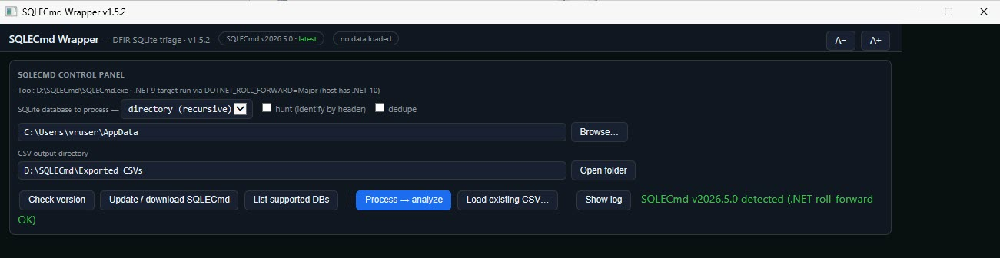

# SQLECmd Wrapper

A single-file Windows **HTA** GUI front-end for Eric Zimmerman's
[SQLECmd](https://github.com/EricZimmerman/SQLECmd), for fast DFIR triage of SQLite
artifacts — with a dedicated browser-history analysis view for Chrome, Edge and Firefox.

No install: it's one `.hta` you double-click.



## What it does

- **Drives SQLECmd from a GUI** — check version, process a single database (`-f`) or
  recurse a directory (`-d`), with `--hunt` (identify SQLite by header) and `--dedupe`
  toggles. SQLECmd runs asynchronously with a progress indicator; the window stays
  responsive.
- **Self-contained tooling** — auto-locates `SQLECmd.exe` next to the `.hta` (or
  `C:\ZimmermanTools\SQLECmd`), offers to download the latest official build if it's
  missing or out of date, and works fully offline with a local copy (the version bubble
  shows *no internet / no web source* when it can't reach the update site).
- **Rich browser-history view** — auto-detected for Chromium HistoryVisits and Firefox
  `places.sqlite`. Classifies each visit (Internal / External / Browser-Local / Searches /
  Typed / Suspicious) and scores suspicious URLs: risky TLDs, URL shorteners, paste/IM
  hosts, dynamic-DNS / tunnels, LOLBINs, ClickFix / fake-CAPTCHA lures, and
  executable/archive download links. Extracts search-engine queries.
- **Cross-browser merge** — combines Chrome + Edge + Firefox histories from a directory
  hunt into one timeline, with a **source-file filter** to slice by browser/profile.
- **Generic table** — any other SQLECmd output opens in a sortable, searchable,
  exportable grid (also with the source-file filter).
- **Triage helpers** — free-text search, date range, hidden-only, CSV export of the
  current view, copy-for-case-notes, and a *List supported DBs* view of every SQLECmd map
  available locally.
- **Resizable columns** (v1.7.0) — drag a column header's right edge to resize; double-click
  the edge to reset. Widths are remembered per column set (the columns change with every
  database/map) in a `SQLECmd-Wrapper.settings.json` sidecar next to the app.

## Requirements

- **Windows** — runs via `mshta.exe` (double-click the `.hta`). Renders in the MSHTML engine.
- **SQLECmd** — auto-downloaded on first run, or drop `SQLECmd.exe` + the `Maps` folder
  next to the `.hta`.
- **.NET runtime** for SQLECmd. Current SQLECmd targets .NET 9; the wrapper sets
  `DOTNET_ROLL_FORWARD=Major` so it also runs on a newer installed runtime (e.g. .NET 10).

## Usage

1. Double-click `SQLECmd-Wrapper.hta`.
2. If prompted, let it download SQLECmd next to the app.
3. Pick a single database file, or a directory to recurse (defaults to the current user's
   `AppData`); optionally tick **hunt**; click **Process → analyze**.
4. Output CSVs are written to `_Processed\<host>\SQLECmd` next to the app (see **Target hostname** below), and the most
   useful result (e.g. merged browser histories) loads automatically.

Use **A− / A+** to scale the UI; the window is resizable.

## Notes & safety

- HTAs run with full local trust and this one launches SQLECmd via the shell — run it from
  a location you trust, and review the source (it's a single readable file) if in doubt.
- All parsing and analysis happen locally. The only network activity is the optional
  SQLECmd version check / download.
- **Running from a network location** (mapped drive / UNC share) works, with one caveat:
  Windows zone policy blocks the UTF-8 file reader (`ADODB.Stream`) there, so the app
  automatically falls back to ANSI file IO (v1.5.5+) and logs a one-time note. Everything
  functions, but non-ASCII characters (e.g. non-Latin URLs or page titles) may display
  incorrectly. For full fidelity copy the folder to a local path and run it from there.
- Not affiliated with or endorsed by Eric Zimmerman. SQLECmd and its Maps are downloaded
  from the author's official distribution and remain subject to their own license; they are
  **not** included in this repository.

## Command line

The wrapper can be launched with arguments so an artifact-finder (or a shortcut) opens it already pointed at an artifact:

```
mshta.exe "SQLECmd-Wrapper.hta" "<inputOrCsv>" ["<outDir>"] [/auto]
```
- `<input>` — a `.csv` (auto-loaded into the viewer) or a SQLite DB file / directory to scan (prefilled; processed if `/auto`).
- `<outDir>` — CSV output directory (optional; defaults to `_Processed\<host>\SQLECmd` next to the app).
- **Target hostname** is required before processing — it names the `_Processed\<host>\SQLECmd` output folder next to the app (family convention shared with the DFIR-Artifact-Finder, so processed evidence is visible per host per tool). Guessed from `Collection-<host>-…` paths, a passed `_Processed\<host>\` outDir, or this machine's name for live paths — overwrite the guess if it's wrong.
- **Run provenance** — every successful run appends a `runinfo.json` entry (app, host, input path, files) in the output folder; the DFIR-Artifact-Finder uses it to show processed state even for standalone runs.
- `/auto` — process immediately.

## License

[MIT](LICENSE)
